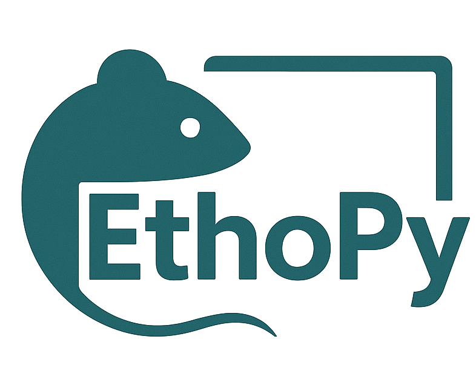
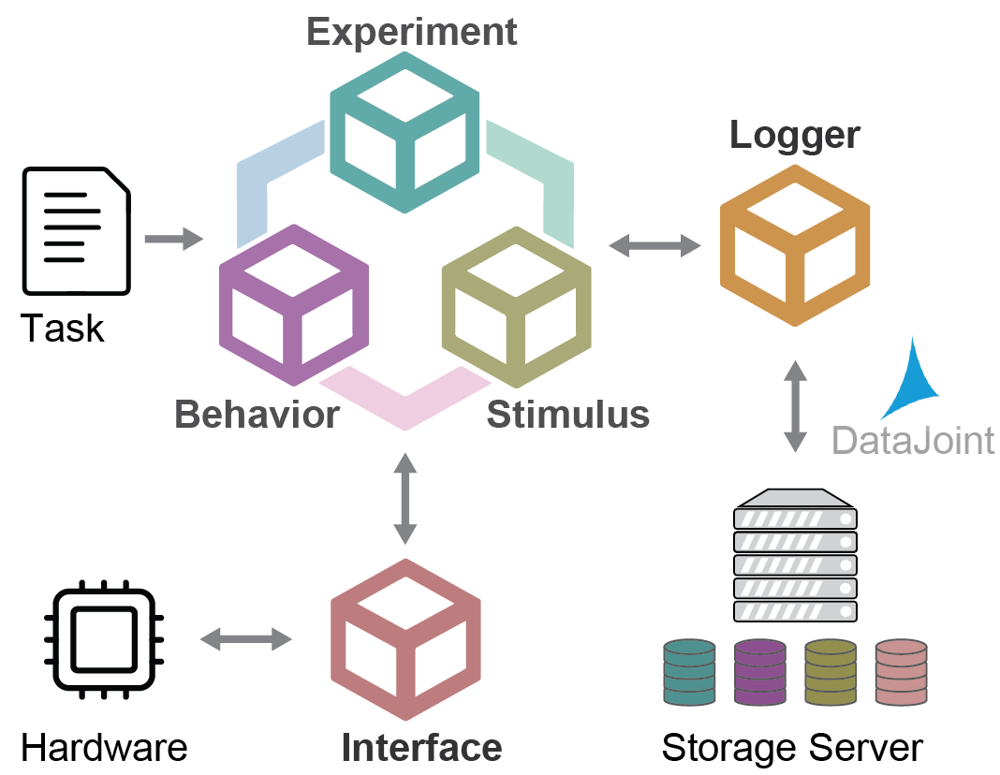
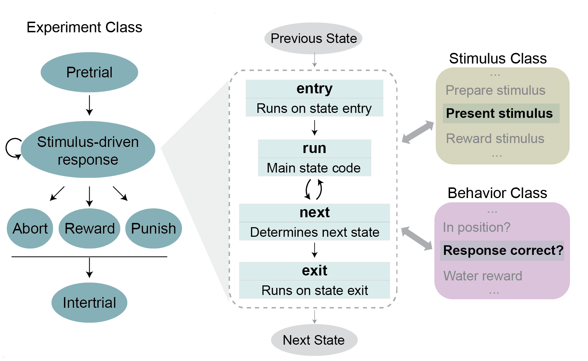

# 

[](https://pypi.python.org/pypi/ethopy)
[](https://pypi.org/project/ethopy/)
[](https://ef-lab.github.io/ethopy_package/)
[](https://opensource.org/licenses/MIT)

**A Python framework for automated behavioral experiments with database integration.**

EthoPy provides a flexible, state-based system for designing and running behavioral experiments. Built for neuroscience research, it offers tight integration with database storage, cross-platform support, and modular architecture for easy customization.

## Getting Started

### Requirements

- Python 3.8 or higher
- Maria DB Database
    - EthoPy requires database setup before running experiments. Follow our step-by-step guide: **[Getting Started Guide](https://ef-lab.github.io/ethopy_package/getting_started/)** for a complete setup from installation to first experiment

### Installation
```bash
pip install ethopy
```

### Run Your First Experiment
```bash
# Test with simulation mode (no hardware required)
ethopy --task-path grating_test.py --log-console

# The simulation uses keyboard controls:
# ← → arrow keys: activate lick ports 1 & 2
# spacebar: proximity detection
```

## Key Features

- **State-based Experiments**: Flexible state machine design for complex behavioral paradigms
- **Database Integration**: Automatic data storage with [DataJoint](https://datajoint.org/)
- **Hardware Agnostic**: Supports Raspberry Pi, Arduino, PC interfaces, or simulation mode
- **Multiple Experiment Types**: 2AFC, match-to-sample, passive presentation, calibration
- **Rich Stimuli**: Visual (gratings, moving bars, dots), olfactory, and custom stimuli
- **Cross-platform**: Linux, macOS, Windows compatibility

## Architecture Overview

Understanding Ethopy's core architecture is essential for both using the system effectively and extending it for your needs. Ethopy is built around five core modules that work together to provide a flexible and extensible experimental framework. Each module handles a specific aspect of the experiment, from controlling the overall flow to managing stimuli and recording behavior.

<div align="center">
  
</div>

- **Experiment**: Defines the state control system with multiple experimental states (PreTrial, Trial, Reward, Punishment, etc.). Each state has four overridable functions that control its behavior and transitions.
- **Behavior**: Handles animal responses and actions (port selection, licking activity, proximity detection)
- **Stimulus**: Creates and manages presented stimuli (visual, olfactory, auditory)
- **Interface**: Hardware communication layer (Raspberry Pi, Arduino, PC interfaces, simulation)
- **Logger**: Data storage and management using DataJoint for seamless database integration

<div align="center">
  
</div>

## Ecosystem

Extend EthoPy with additional tools:

- **[EthoPy Analysis](https://github.com/ef-lab/ethopy_analysis)** - Data analysis pipelines
- **[EthoPy Plugins](https://github.com/ef-lab/ethopy_plugins)** - Community extensions
- **[EthoPy Control](https://github.com/ef-lab/ethopy_control)** - Web-based remote control

## Documentation

**[Full Documentation](https://ef-lab.github.io/ethopy_package/)**

**Essential Guides:**
- **[Getting Started](https://ef-lab.github.io/ethopy_package/getting_started/)** - Run your first experiment
- **[Installation Guide](https://ef-lab.github.io/ethopy_package/installation/)** - Complete setup instructions
- **[Configuration](https://ef-lab.github.io/ethopy_package/local_conf/)** - Database and hardware setup
- **[Task Creation](https://ef-lab.github.io/ethopy_package/task_setup/)** - How to design your custom experiments
- **[Troubleshooting](https://ef-lab.github.io/ethopy_package/troubleshooting/)** - Common issues and solutions

## Contributing

We welcome contributions! See our [Contributing Guide](https://ef-lab.github.io/ethopy_package/contributing/) for:

- Development setup
- Code standards
- Documentation updates

## License

MIT License - see [LICENSE](https://github.com/ef-lab/ethopy_package/blob/master/LICENSE) for details.

## Support

- [Documentation](https://ef-lab.github.io/ethopy_package/)
- [Report Issues](https://github.com/ef-lab/ethopy_package/issues)