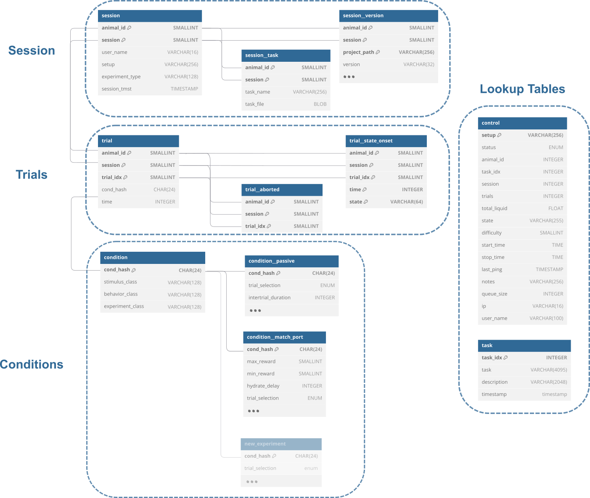
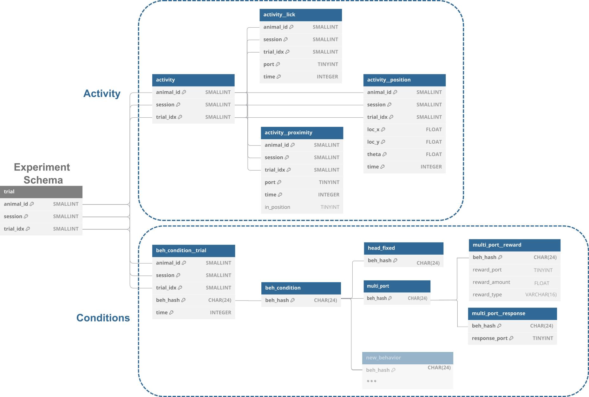
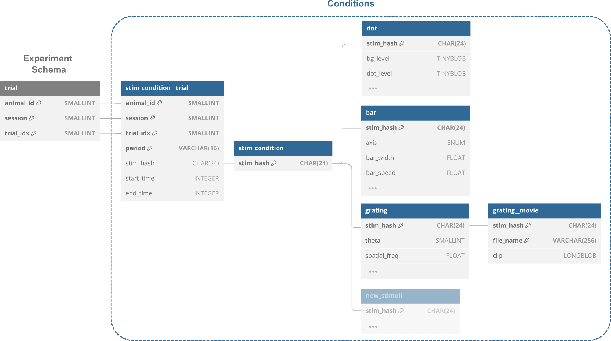
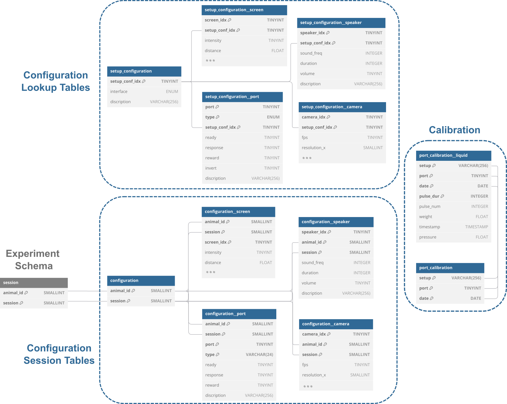

# Database Schema Structure

EthoPy employs a relational database architecture built on DataJoint, a Python framework that provides intuitive access to SQL databases like MySQL and MariaDB. The database structure is compartmentalized into specialized schemas, distinct collections of interconnected tables that organize different aspects of experimental data.

The system utilizes five primary schemas: experiments, behavior, stimuli, interfaces, and recordings. Each schema contains carefully designed table structures that collectively capture all experimental parameters, outcomes, and metadata with full traceability.

## Experiment Schema

This schema serves as the central hub for experimental metadata and session management, organizing data hierarchically from sessions down to individual trial events.

  

### Core Components:

**Session Management**: The foundational Session table maintains comprehensive metadata for each experimental run, including researcher identity, hardware setup identifier, experiment classification, start time, task configuration file, and software version tracking. Each session uniquely identifies an experiment for a particular subject (animal_id).

**Trial Organization**: Individual trials are systematically recorded and linked to their parent sessions through shared identifier keys (animal_id, session). The Trial table maintains trial specific data while connecting to state transition records that document the temporal sequence of experimental phases (such as Trial, Reward, or Punishment states).

**Condition Management**: Each trial references a distinct experimental condition set via a computed hash identifier (cond_hash). This cryptographic fingerprint ensures that trials sharing identical parameters can be efficiently grouped and analyzed. The condition framework supports modular experimental designs through specialized subtables (condition_passive, condition_match_port, condition_free_water) that store paradigm-specific parameters including reward magnitudes, inter-trial durations, and trial selection algorithms. New experimental paradigms can extend this architecture by creating additional condition subtables that maintain referential integrity through the shared cond_hash system.

**Real-time Control**: The control table provides operational oversight for active experimental setups, like current state information, trial progression and reward delivery. This component enables dynamic monitoring and control of ongoing experiments.

**Task Registry**: A lookup table maintains an indexed catalog of task configuration files, associating unique identifiers (task_idx) with descriptive information, file paths, and creation timestamps.

## Behavior Schema

This schema captures comprehensive behavioral data through two interconnected organizational structures: Activity recording and Condition specification.

  

### Architecture:

**Activity Recording**: Multiple specialized tables (activity, activity_position, activity_lick, activity_proximity) document real-time behavioral events during experimental trials. These tables capture spatial tracking data, licking behaviors, and proximity sensing relative to interaction devices. All activity data maintains direct linkage to the experiment schema through shared primary keys (animal_id, session, trial_idx).

**Behavioral Conditions**: The behavioral parameter framework centers around the beh_condition table, identified by unique behavioral hash codes (beh_hash). This connects to specific parameter tables (multi_port, multi_port_reward, multi_port_response) that define target behaviors and response criteria, such as correct port selections for reward delivery.

## Stimulus Schema

This schema provides comprehensive management of stimulus generation and presentation parameters throughout experimental sessions.

  

### Organization:

**Stimulus Parameterization**: Each trial associates with a unique stimulus hash (stim_hash) that encapsulates all stimulus-specific parameters. The stim_condition table serves as the central repository for these parameters, while stim_condition_trial provides trial-specific linkage and presentation timing information.

**Modular Stimulus Types**: Detailed configurations for different stimulus categories (dot, bar, grating, grating_movie) are maintained in dedicated specialized tables. All stimulus subtables maintain connectivity through the shared stim_hash identifier, enabling flexible stimulus design while preserving data relationships.

## Interface Schema

This schema manages hardware configuration parameters and calibration data essential for experimental reproducibility and equipment maintenance.

  

### Components:

**Setup Configuration**: The hardware configuration system enables users to define complete experimental setups through reference to predefined component libraries. Users can specify entire hardware arrangements by selecting a setup configuration identifier, which automatically maps to all associated components (ports, sensors, displays) and their operational parameters.

**Session-Specific Configuration Storage**: To ensure experimental reproducibility, the exact hardware configuration used during each session is permanently archived, creating an immutable record of experimental conditions. This approach preserves precise hardware states even when reference configuration tables are subsequently modified.

**Calibration Management**: Dedicated calibration tables maintain time-varying hardware characteristics, such as liquid delivery volumes for individual dispensing ports. This system tracks hardware performance drift and supports quality control procedures.

## Schema Integration and Data Flow

The database architecture employs relational connections that ensure data consistency and experimental traceability. The schema design supports addition of new experimental paradigms, stimulus types, and hardware configurations without disrupting existing data structures. This architectural approach provides researchers with a comprehensive, scalable, and maintainable system for managing complex behavioral experimental data while ensuring full experimental reproducibility and data integrity.